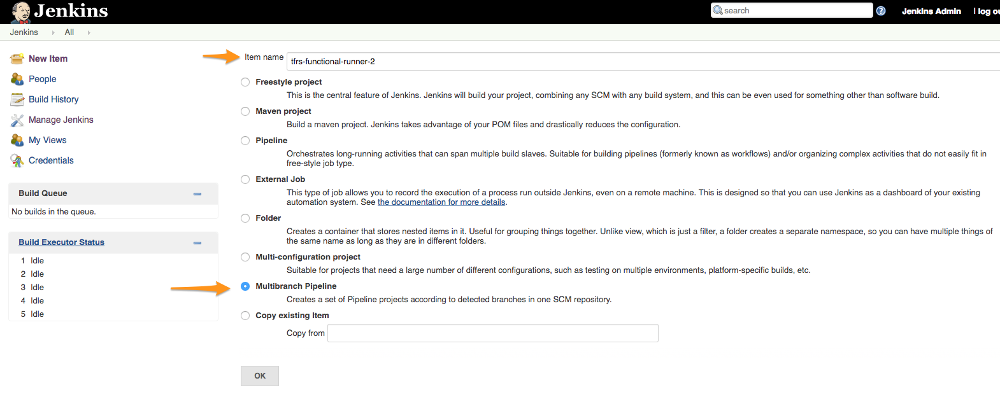
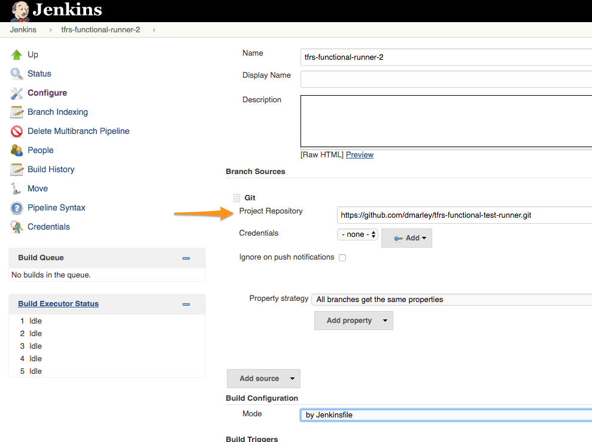
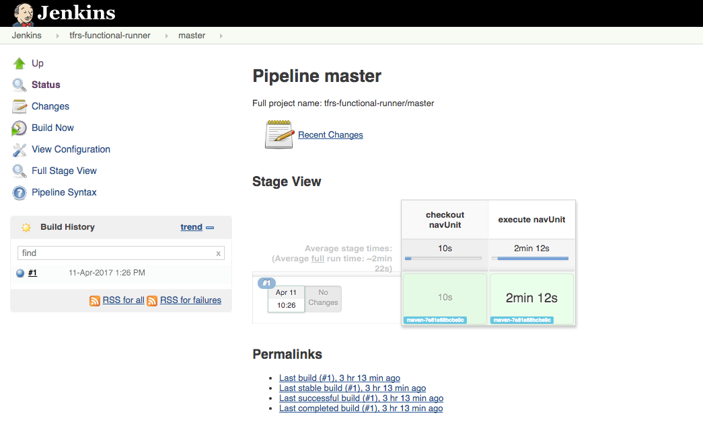

# tfrs-functional-test-runner

## Purpose

This project was created to demonstrate how to configure and run navUnit (https://github.com/bcgov/navUnit) funcational 
test framework from within a Jenkins Pipeline File via Gradle Build Script

***Example:***
````java
node('maven') {
   stage('checkout navUnit')
   git url: 'https://github.com/bcgov/navUnit.git'

   stage('execute navUnit')
   sh './gradlew phantomJsTest'
}
````


### Gradle and Gradle Wrapper

Gradle is a modern Application build tool that helps teams build, automate and deliver better software, faster.
Gradle is an Open Source Build Automation system that builds upon the concepts of Apache Ant and Apache Maven.

The Gradle Wrapper was developed to remove the steps of installing and configuring "another tool" on developer workstations and build servers.
The Gradle Wrapper solves these steps by configuring and installing the tool by itself.  When the gradle wrapper command is executed 
it first detects if it has all dependencies to build a project, and if it does not it will download and configure first.

Example:
```java
./gradlew test
or
gradlew.bat test
```
### Jenkins Pipeline (source file)

Jenkins Pipeline is a suite of plugins which supports implementing and integrating continuous delivery pipelines into Jenkins.
Pipeline provides an extensible set of tools for modeling simple-to-complex delivery pipelines "as code" via the Pipeline DSL.

The ***Jenkinsfile***, which is checked into source control provides a number of benifits:
* Code review/iteration on the Pipeline
* Audit trail for the Pipeline
* Sintle Source of truth of the Pipeline, which can be viewd and edited by multiple members of the project.

*Retrieved from: https://jenkins.io/doc/book/pipeline/jenkinsfile/*

### Configure Jenkins

<span style="color:green">Step 1.</span> Create a new Jenkins Job


<span style="color:green">Step 2.</span> Click on 'Add source' button and specify source, and at this time it is wise to add ***Max#*** builds value



<span style="color:green">Step 3.</span> Enter the Source Code Repository where the 'Jenkinsfile' is located


***Result:***

